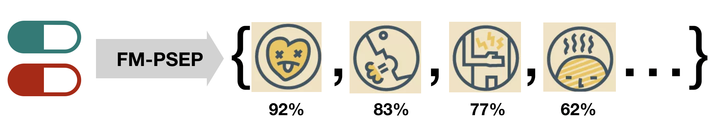
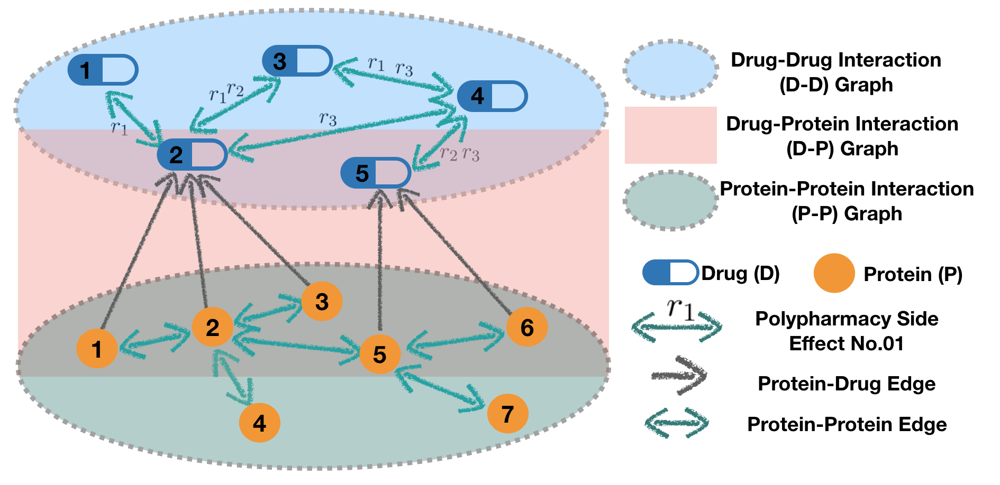
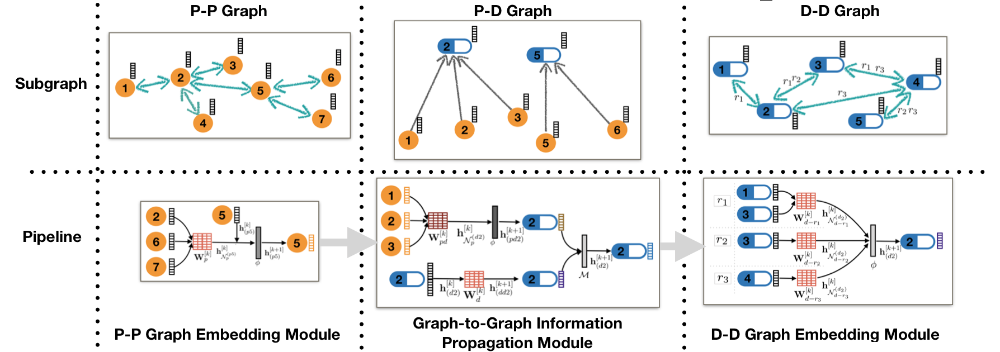
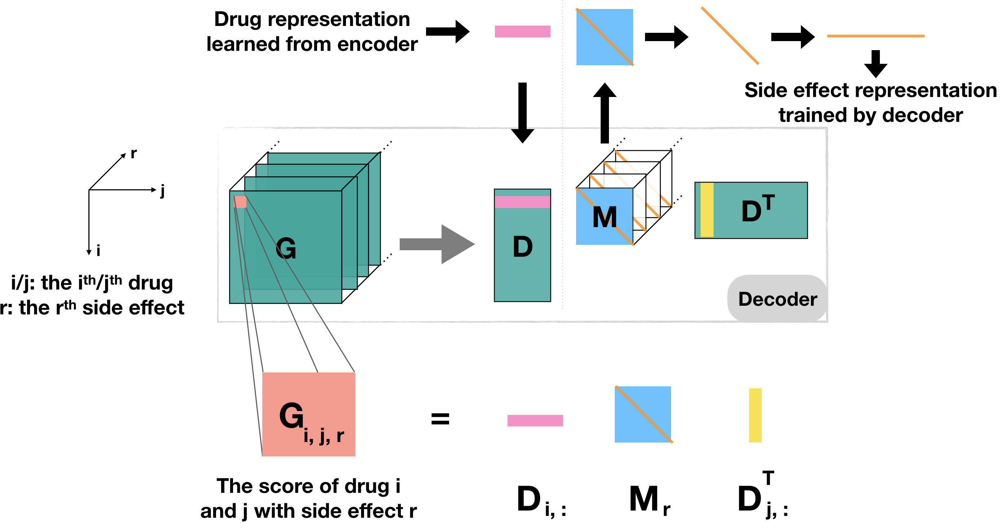

# Tri-graph Information Propagation (TIP) model

TIP is an efficient general approach for **multi-relational link prediction** in any **multi-modal**  (i.e. heterogeneous and multi-relational) network with two types of nodes. It can also be applied to the **Knowledge Graph Completion** and **Recommendation** task. TIP model is inspired by the [Decagon](https://github.com/marinkaz/decagon) and [R-GCN](https://github.com/tkipf/relational-gcn) models, motivated by their limitations of high computational cost and memory demand when graph goes really complex. TIP improves their link prediction **accuracy**, and time and space **efficiency** of node representation learning. See details on the algorithm in our paper [(Xu, Sang, and Lu, 2019)](https://grlearning.github.io/papers/94.pdf).

## TIP for Polypharmacy Side Effect Prediction

we are particularly concerned about the safety of [polypharmacy](https://en.wikipedia.org/wiki/Polypharmacy), which is the concurrent use of multiple medications by a patient. Given a pair of drugs (:pill:,:pill:), the TIP model will predict how many polypharmacy side effects the drug pair will have, and what are the possibilities.

<div align=center>

</div>

We use *POSE clinical records* and *pharmacological information* to construct a multi-modal biomedical graph with two types of nodes: Drug (D) and Protein (P). The graph contains three types of interaction (refer to three subgraphs): 

&emsp; :cookie: &ensp; D-D graph: drug-drug interactions with side effects as edge labels

&emsp; :cake: &ensp; P-D graph: protein-drug interactions (with a fixed label)

&emsp; :ice_cream: &ensp; P-P graph: protein-protein interactions (with a fixed label)

<div align=center>

</div>

TIP model embeds proteins and drugs into different spaces of possibly different dimensions in the encoder, and predict side effects of drug combinations in the decoder. As shown below, TIP learns the protein embedding firstly on the P-P graph, and passes it to D-D graph via D-P graph. On D-D graph, TIP learns drug embedding and predicts relationships between drugs.

**TIP Encoder**:

<div align=center>

</div>

**TIP Decoder**:

<div align=center>

</div>

## Source Code

TIP is implemented in [PyTorch]([`pytorch`](https://pytorch.org/)) with [PyG](https://github.com/rusty1s/pytorch_geometric) package. It is developed and tested under Python 3.  

### Requirement

You can install the `pytorch` and `pyg` packages with the versions that matches your hardware, or use the same environment as mine using the following commands:

```shell
$ conda create -n tip-gpu python==3.9
$ conda install pytorch==1.8.0 torchvision==0.9.0 torchaudio==0.8.0 cudatoolkit=10.2 -c pytorch
$ conda install pyg==2.0.1 -c pyg -c conda-forge	
```

*(Optional)* If you are interested in monitoring GPU memory usage of the model, the `pytorch_memlab` package is helpful.
```shell
$ pip install pytorch_memlab
```

*(Optional)* TIP is trained and tested on a single **GPU**. If you are interested in training TIP using multiple GPUs, `pytorch_lightning` would be helpful.

### Running

The processed data and the code for data processing are in the `./data/` folder. The raw datasets are available on the [BioSNAP](http://snap.stanford.edu/biodata/index.html). See `./data.ipynb` for the full polypharmacy datasets analysis and data preprocessing.

**Step 1**: preparing data. Run it once to generate a `data_dict.pkl` file in `./data/` folder).
```shell
python prepare.py			
```

**Step 2**: training and testing model. The default model is `TIP-cat`. If you want to train and test a `TIP-add` model, change the value of variable `MOD` from `'cat'` to `'add'`. 
```shell
python tip.py
```

By following the above steps and using the default hyper-parameter settings, the results that are shown in the TIP paper [(Xu, Sang, and Lu, 2019)](https://grlearning.github.io/papers/94.pdf) can be reproduced.

:new_moon_with_face::waxing_crescent_moon::first_quarter_moon::waxing_gibbous_moon: **Please browse/open issues should you have any questions or ideas**​ :waning_gibbous_moon::last_quarter_moon::waning_crescent_moon::new_moon_with_face:

## License

TIP is licensed under the MIT License.
